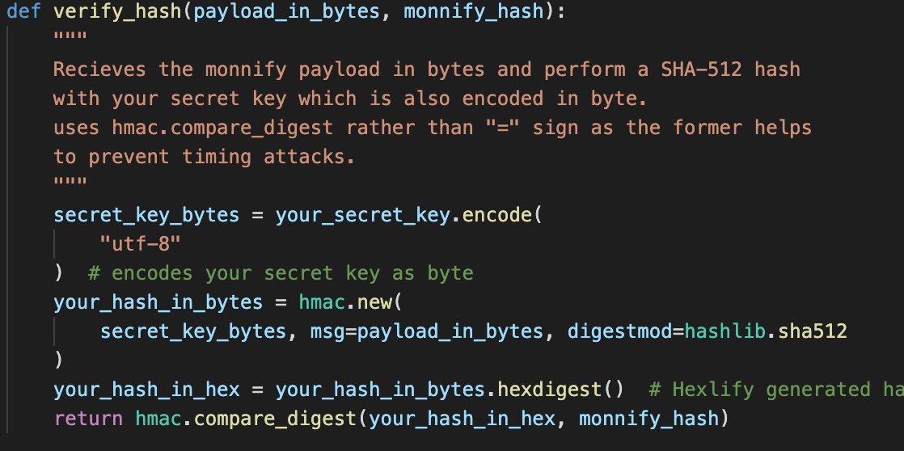

# monnify-django-webhook
 This is a sample code that shows how to calculate and verify monnify webhook hash  
using the Django web framework. Similar ideas holds for other Python web frameworks

---

### Table of Contents

- [monnify-django-webhook](#monnify-django-webhook)
    - [Table of Contents](#table-of-contents)
      - [Technologies](#technologies)
  - [Installation](#installation)
      - [Already Have Python3 Installed](#already-have-python3-installed)
      - [Already Have Docker installed](#already-have-docker-installed)
    - [Test](#test)
    - [SetUp](#setup)
  - [Clarification](#clarification)

---

#### Technologies
This sample code was built with python 3.9, but would also work on python 3.7 and above. 

- Python==3.9
- Django==3.2
- DjangoRestFramework==3.13
  
[Back To The Top](#read-me-template)

---

## Installation
#### Already Have Python3 Installed
```bash
clone the repo:

git clone https://github.com/marvelous-benji/monnify-django-webhook.git

change to monnify-django-webhook directory:

cd monnify-django-webhook

install virtualenv:

pip install virtualenv

create a virtual environment:

python -m venv env

activate virtual environment:

source env/bin/activate

install dependencies:

pip install -r requirements.txt

set necessary environment variables:
    for *nix operating systems (MacOs and Linux)
            export MONNIFY_SECRET={your monnify secret key}
            export MONNIFY_IP=35.242.133.146

    for windows OS
            set MONNIFY_SECRET={your monnify secret key}
            set MONNIFY_IP=35.242.133.146
```

#### Already Have Docker installed

```bash
clone the repo:

git clone https://github.com/marvelous-benji/monnify-django-webhook.git

change to monnify-django-webhook directory:

cd monnify-django-webhook

build docker container:

docker build -t mnfwebhook .

```
---

### Test
After Installation, you can run tests by running
```bash
python manage.py test
```
---

### SetUp
After Installation, you will need to start the server.
```bash
Without docker simply run:

python manage.py runserver

with docker simply run:
 
docker run -it --publish 8000:8000 mnfwebhook

install ngrok proxy:

(MacOs) brew install ngrok
(Linux) sudo apt-get install ngrok

start ngrok proxy:

ngrok http 8000
```


```bash

finally add the displayed ngrok url as one of   
your allowed host in your monnify/settings.py  

ALLOWED_HOST = ['{your ngrok https url}']

Also on your monnify dashboard, go to settings,  
then the webhook tab, add on any of the input  
field:
for function based views
{your ngrok https url}/webhook_listen 

for class based views
{your ngrok https url}/webhook_listener
```
---

## Clarification


from the image above, it's important you receive the payload as bytes rather than as json that is converted  
to bytes because during the conversion, some data in the payload are reformatted(for example double quote   
becomes single quote or vice versa, spaces are either added between data or removed) and all these affects the final hash.



It's a security best practice to use  
```python
hmac.compare_digest rather than ==
```  
whenever you compare hashes, so as to prevent timing attacks (https://news.ycombinator.com/item?id=11119154)  

---


When verifying a webhook ip address, you should  check wether your   
server is behind a proxy(like nginx)  as the IP coming to the server would be that of the proxy, so you should check what the forwarded IP is. (configured by you set by default) Otherwise(when not behind a proxy) the real ip belongs to the webhook.


